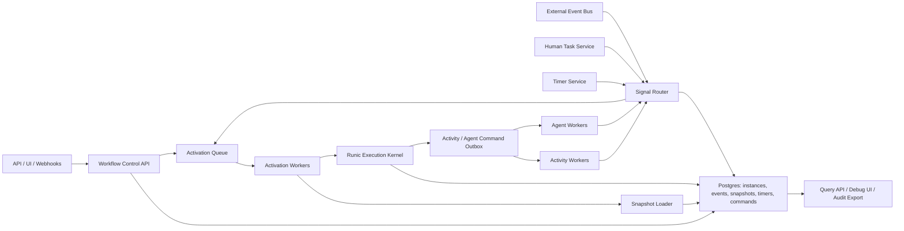
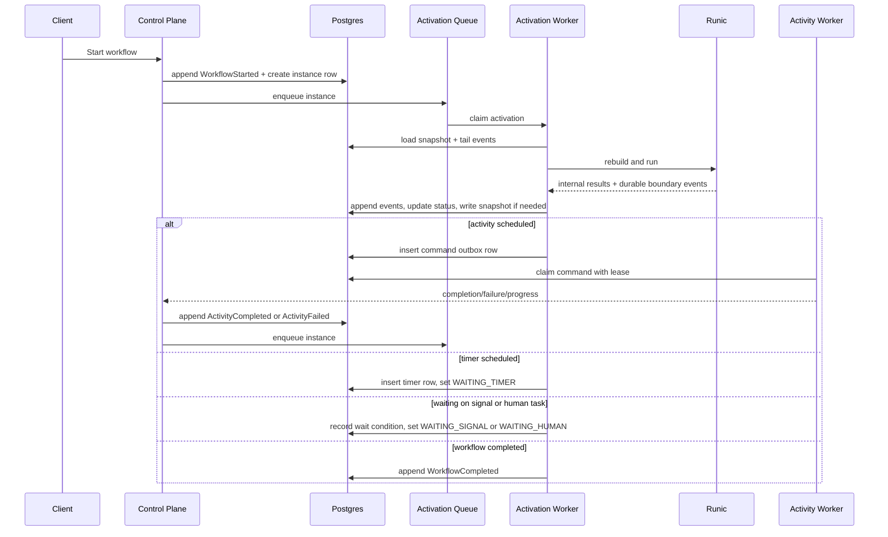
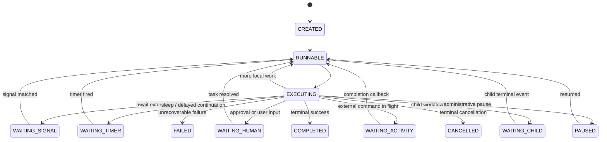

# Runic Durable Orchestration Assessment

This assessment remains background analysis and source evidence.
For the canonical implementation target, see [runic-durable-orchestration-design-guide.md](./runic-durable-orchestration-design-guide.md).

Assessed on March 6, 2026.

Scope:
- Reviewed the local `runic/` snapshot in this workspace, which reports `version: "0.1.0-alpha.3"` in `runic/mix.exs`.
- Reviewed the Runic guides, especially `runic/guides/durable-execution.md`, `runic/guides/scheduling.md`, `runic/guides/execution-strategies.md`, and `runic/guides/protocols.md`.
- Reviewed the runtime, runner, store, replay, and coordination code paths under `runic/lib/`.
- Ran durability-focused tests in `runic/`:
  - `mix test test/runner/durable_execution_test.exs test/workflow/rehydration_test.exs test/workflow/event_sourced_test.exs test/runner/store_mnesia_test.exs`
  - Result: 124 tests, 0 failures

## 1. System design overview

### Executive summary

Runic is a credible inner runtime for deterministic workflow transitions, replay, and graph coordination. It is not a complete production runtime for durable, long-lived orchestration by itself.

My opinionated answer is:
- Use Runic as the deterministic execution kernel for active bursts of workflow progress.
- Do not use `Runic.Runner` as the primary dormant-workflow runtime.
- Put a stronger control plane around Runic that owns instance lifecycle, durable waiting, timers, signals, human tasks, activities, replay, and querying.
- Use Postgres as the system of record. Do not use ETS or Mnesia as the authoritative durability layer for this platform.

### Why Runic is still useful

Runic already has several properties that are valuable for a durable orchestration engine:
- A real three-phase model: prepare, execute, apply. This is the right separation for orchestration because execution can be detached from state transition logic.
- Replayable workflow state via `Workflow.from_log/1` and `Workflow.from_events/3`.
- Rehydration support with `:full`, `:hybrid`, and `:lazy` modes.
- Strong intra-workflow coordination primitives: joins, fan-out, fan-in, reduce, stateful reactions, batching schedulers, and pluggable executors.
- Serializable workflow closures, with caveats, via `Runic.Closure`.

Those are strong execution-kernel traits.

### Why Runic is not enough on its own

The current snapshot still lacks the primitives that matter most for month-scale orchestration:
- No first-class durable wait model for timers, signals, approvals, or child completion.
- No parking model that unloads dormant executions and later reactivates them without keeping a worker alive.
- No durable activity protocol for external side effects with leases, heartbeats, and dedupe.
- No first-class parent/child workflow lifecycle.
- No definition registry, workflow version pinning, or controlled migration system.
- No production query model for "why is this workflow waiting?" or "what is the current outstanding command?"
- No automatic ownership recovery across cluster restarts beyond explicit `resume/3`.

### Concrete suitability verdict

For your target problem, Runic is a:
- Good fit as the workflow state transition engine.
- Bad fit as the only runtime abstraction.
- Viable foundation if surrounded by a control plane designed for dormant, event-driven workflow instances.

### Durable primitives required in addition to Runic

If Runic is the execution kernel, the platform still needs all of the following:

| Primitive | Why it is required |
| --- | --- |
| Durable instance registry | Track lifecycle state such as `RUNNABLE`, `WAITING_SIGNAL`, `WAITING_TIMER`, `WAITING_HUMAN`, `WAITING_ACTIVITY`, `PAUSED`, `FAILED`, and `COMPLETED`. |
| Append-only event store | Make every workflow transition durable, ordered, replayable, and auditable. |
| Snapshot store | Avoid full replay from event 1 for long-lived instances. |
| Activation queue | Wake only runnable instances; do not keep one process resident per execution. |
| Timer subsystem | Support sleep-until, deadlines, reminders, escalations, and delayed continuation without sleeping a process. |
| Signal inbox and router | Accept external events, correlate them to waiting instances, dedupe them, and append them durably. |
| Human task subsystem | Model approval, rejection, expiration, reassignment, and audit metadata as workflow inputs. |
| Activity subsystem | Execute external side effects outside the workflow evaluator with idempotency keys, retries, leases, and completion callbacks. |
| Definition registry and migration layer | Pin instances to immutable workflow definitions and support safe upgrades. |
| Query projections | Answer operational questions without replaying every workflow on every request. |
| Ownership and recovery leases | Recover from worker death, node loss, or deploy interruption without manual intervention. |
| Agent session subsystem | Support long-lived agentic tasks, tool execution, heartbeats, approvals, and transcript storage. |

### Opinionated platform shape

The production platform should work like this:
- Most workflow instances live only in Postgres rows and event history.
- A workflow becomes hot only when new work is available.
- An activation worker loads snapshot plus tail events, rebuilds Runic state, runs until quiescent or a durable wait boundary, appends new events, updates projections, and exits.
- External side effects never happen as opaque step closures that the platform cannot reason about.
- Wait states are represented explicitly in durable storage.

That turns the system from "one GenServer per workflow" into "event-sourced workflow state plus short-lived activation bursts."

### Hard answers to the core design questions

#### Postgres vs Mnesia

Use Postgres as the source of truth.

Why:
- You need transactional append, row locking, leases, strong operational tooling, backups, and queryability.
- You need a control plane that can power APIs, dashboards, audits, and multi-tenant filtering.
- You need workflow history to be durable across deploys and cluster topology changes without coupling the whole system to Erlang cluster membership.
- Mnesia is acceptable for OTP-native local state or niche cluster-local systems. It is not the database I would choose for a workflow control plane that must answer product and operations queries.

Mnesia is still acceptable for:
- transient caches
- local accelerators
- small internal OTP-native deployments where Postgres is unavailable

It should not be your authoritative event store.

#### Event sourcing vs mutable row state

Use event sourcing plus projections.

Why:
- Durable orchestration is fundamentally about reconstructing state after long periods, failures, and changing inputs.
- Append-only history gives you replay, audit, debugging, compensation context, and version-aware recovery.
- Mutable rows alone lose too much information and make debugging long-lived workflows painful.

The practical design is:
- append-only `workflow_events`
- materialized `workflow_instances`
- periodic `workflow_snapshots`
- purpose-built projections for search and operations

#### Resident processes vs ephemeral workers

Use ephemeral activation workers for workflow execution.

Why:
- A system with millions of dormant workflows cannot keep a process open per workflow.
- Long waits should consume rows, not BEAM processes.
- Ephemeral activations make deploys, node drains, and crash recovery much simpler.

Use long-lived processes only where they are justified:
- activity workers with leases
- agent workers with heartbeats
- local queue consumers

#### Exactly-once vs effectively-once

Promise effectively-once, not exactly-once, for external side effects.

Why:
- Exactly-once across process crashes and external APIs is usually marketing, not a real guarantee.
- The correct boundary is: append intent durably, dispatch commands idempotently, dedupe completions, and make workers safe to retry.

## 2. Architecture diagrams

### 2.1 High-level platform architecture

### 2.2 Activation lifecycle

### 2.3 Durable workflow state machine

## 3. Implementation details

### 3.1 Workflow runtime model

Runic should execute only active transition bursts.

Execution loop:
1. Claim one activation for an instance.
2. Load `workflow_instances`, latest snapshot, and the tail of `workflow_events`.
3. Materialize the Runic workflow from immutable definition plus replayed runtime history.
4. Execute until one of these happens:
   - no more immediately runnable work
   - an external activity is scheduled
   - a timer is scheduled
   - a signal wait is registered
   - a human task is opened
   - a child workflow is created
   - the workflow reaches a terminal state
5. Append all new events in one transaction.
6. Update projections and queue follow-up work.
7. Exit the activation worker.

This is the right boundary:
- Runic decides what the workflow state transition is.
- The platform decides how that transition becomes durable and how external work is executed.

### 3.2 Durable state storage

Use Postgres tables like these:

| Table | Purpose |
| --- | --- |
| `workflow_definitions` | Immutable definition records, version, metadata, compatibility rules, and optional compiled build artifacts. |
| `workflow_instances` | Current materialized status, `last_seq`, `snapshot_seq`, current wait reason, ownership lease, timestamps, tenant metadata. |
| `workflow_events` | Append-only ordered event stream per instance. |
| `workflow_snapshots` | Compressed materialized workflow state at a given event sequence. |
| `workflow_waits` | Normalized outstanding wait conditions such as signal key, timer id, human task id, child instance id. |
| `workflow_timers` | Durable timer schedule and firing state. |
| `workflow_signals` | Received signal inbox for dedupe, authorization, and audit. |
| `workflow_commands` | Activity or agent commands waiting to be claimed and executed. |
| `workflow_human_tasks` | Approval and review tasks plus assignee, SLA, and resolution metadata. |
| `workflow_children` | Parent-child links and child wait conditions. |
| `workflow_activations` | Runnable queue rows with lease information and reason for wake-up. |
| `workflow_search` | Query projection for UI and APIs. |

Core keys and constraints:
- `workflow_events`: unique `(tenant_id, instance_id, seq)`
- `workflow_instances`: optimistic version or `last_seq`
- `workflow_timers`: unique `(instance_id, timer_id)`
- `workflow_signals`: unique `(instance_id, dedupe_key)`
- `workflow_commands`: unique `(instance_id, command_id)` and `idempotency_key`

### 3.3 Append-only execution log and event history

Every meaningful transition must become an event.

Event classes:
- control events: `WorkflowStarted`, `WorkflowPaused`, `WorkflowResumed`, `WorkflowCancelled`
- Runic runtime events: build events, fact production, activations, join/fan-in events, policy lifecycle events
- orchestration boundary events: `TimerScheduled`, `SignalWaitRegistered`, `HumanTaskOpened`, `ActivityScheduled`, `ChildWorkflowStarted`
- external completion events: `TimerFired`, `SignalReceived`, `HumanTaskResolved`, `ActivitySucceeded`, `ActivityFailed`, `ChildWorkflowCompleted`
- migration events: `DefinitionPinned`, `DefinitionMigrated`, `PatchApplied`

Recommended append semantics:
- fetch instance row `FOR UPDATE`
- verify expected `last_seq`
- append events with monotonically increasing sequence numbers
- update instance projection in the same transaction
- insert activation, command, wait, or timer rows in that same transaction

This is how you avoid split-brain state between "history says one thing" and "queue says another."

### 3.4 Snapshot strategy

Use snapshots aggressively enough to cap replay cost, but not on every event.

Recommended policy:
- snapshot every 100 to 500 events
- snapshot whenever the workflow enters a durable wait state
- snapshot before definition migration
- snapshot before archival cutover

Snapshot contents:
- workflow instance metadata
- Runic workflow state needed for fast rehydration
- snapshot schema version
- definition id and definition version
- optional summary payload for query endpoints

Storage format:
- `:erlang.term_to_binary/1` is acceptable for an Elixir-native system, but store a JSON summary alongside it
- compress snapshot blobs
- keep snapshots versioned so they can be upcast later

### 3.5 Timer and scheduling subsystem

Timers must be durable rows, not sleeping processes.

Model:
- Runic emits `TimerScheduled(timer_id, fire_at, purpose)`
- the control plane writes a `workflow_timers` row and sets the instance to `WAITING_TIMER`
- a timer service scans due timers using `FOR UPDATE SKIP LOCKED`
- when due, it appends `TimerFired` and enqueues the instance

Properties you need:
- dedupe by `timer_id`
- idempotent firing
- retryable scanner
- timer cancellation on workflow completion or cancellation
- support for long delays without any compute remaining open

### 3.6 Signal ingestion and event routing

Signals are how dormant workflows wake up.

Ingress sources:
- HTTP API
- internal service calls
- message bus consumers
- webhook adapters
- human task resolutions
- activity and child-workflow completion callbacks

Routing model:
1. authenticate and authorize the sender
2. normalize the signal payload
3. compute a dedupe key
4. persist it in `workflow_signals`
5. match it against outstanding `workflow_waits`
6. append a domain event such as `SignalReceived`
7. enqueue the instance

Recommended API shape:
- `POST /api/workflows/:instance_id/signals/:signal_type`
- optional correlation headers
- explicit idempotency key

### 3.7 Pause, resume, and human-in-the-loop mechanics

Pause and resume must be platform events, not in-memory toggles.

Pause:
- append `WorkflowPaused`
- prevent new ordinary activations from starting
- keep history queryable
- decide by policy whether timers continue to count down

Resume:
- append `WorkflowResumed`
- rebuild effective waits and timers
- enqueue the instance

Human task model:
- Runic emits `HumanTaskOpened`
- control plane creates a `workflow_human_tasks` row
- users approve, reject, comment, or reassign through an API/UI
- resolution appends `HumanTaskResolved`
- workflow resumes from durable state

This is much safer than trying to keep a workflow process blocked on user input.

### 3.8 Worker and compute model

Use three compute planes:

1. Activation workers
- short-lived
- stateless except for local activation memory
- rebuild state from durable storage
- run Runic until a durable boundary

2. Activity workers
- claim `workflow_commands`
- execute external side effects
- heartbeat if long-running
- report progress and completion back as events

3. Agent workers
- specialized activity workers for long-lived agentic tasks
- support leases, token budgets, heartbeats, tool execution, and transcript persistence

Do not keep a permanent `Runic.Runner.Worker` process per instance.

### 3.9 Recovery and replay strategy

Recovery should be automatic and lease-driven.

Recommended design:
- `workflow_activations` rows have `lease_owner` and `lease_expires_at`
- if a worker crashes, another worker reclaims the activation after lease expiry
- replay starts from latest snapshot plus event tail
- if no snapshot exists, replay from the full stream
- after replay, run exactly one activation burst and persist the next state

What to recover:
- orphaned activations
- overdue commands with expired worker lease
- stuck timers
- unfinished human tasks with expiration or escalation

Important boundary:
- recovery should re-drive durable commands and waits from event history
- recovery should not blindly rerun opaque side-effecting closures

### 3.10 Retries, idempotency, and execution semantics

Semantics should be:
- at-least-once for workflow activation
- effectively-once for external commands
- never promise global exactly-once

Pattern:
1. workflow appends `ActivityScheduled`
2. control plane writes `workflow_commands`
3. worker claims the command using a lease and idempotency key
4. worker calls the external system with that key
5. worker appends `ActivitySucceeded` or `ActivityFailed`
6. duplicate callbacks are ignored by dedupe key

Retries:
- workflow retries are separate from activity worker retries
- backoff lives in the command record and worker policy
- retry exhaustion becomes a durable event the workflow can react to

### 3.11 Mutation and adaptation of running workflows

There are two very different kinds of change:

1. Data-level adaptation
- new signals
- additional facts
- policy changes
- user overrides

This can happen freely and should be modeled as events.

2. Structural workflow change
- new nodes
- removed nodes
- changed control flow
- updated agent plan semantics

This should be constrained.

Recommended rule:
- pin every instance to an immutable definition version
- only migrate at safe points: `WAITING_SIGNAL`, `WAITING_TIMER`, `WAITING_HUMAN`, `WAITING_ACTIVITY`, `WAITING_CHILD`
- append explicit migration events
- keep old definitions runnable until all pinned instances are gone or migrated

Do not mutate running instances ad hoc in memory.

### 3.12 Parent/child workflows and fan-out/fan-in

Use Runic for intra-instance coordination.
Use the control plane for inter-instance coordination.

Inside one workflow instance:
- use Runic joins, fan-out, fan-in, reduce, and state reactions

Across workflow instances:
- use child workflows
- record parent-child links
- append `ChildWorkflowStarted`
- park the parent in `WAITING_CHILD`
- wake the parent on child terminal events

For large fan-out:
- create child instances or command batches
- track expected count and completion count durably
- avoid keeping tens of thousands of leaf tasks inside one resident process

### 3.13 Support for long-lived agentic steps

Agentic work should be modeled as a long-lived external command protocol.

Recommended pattern:
- workflow emits `AgentSessionStarted`
- an agent worker claims the session with a lease
- progress becomes `AgentProgressReported`
- tool calls are stored as child command records
- human approvals can pause the session
- terminal outcomes are `AgentSessionCompleted` or `AgentSessionFailed`

Persist separately:
- transcript chunks
- tool inputs and outputs
- model metadata
- cost and token usage
- checkpoints for resumable agent execution

Do not run a multi-hour agent session inside one opaque Runic `Step`.

### 3.14 Observability, auditability, and debugging

You need more than telemetry counters.

Build:
- a query API for current instance status
- a history endpoint that streams the ordered event log
- a wait-reason view that explains exactly what is blocking progress
- an activation timeline view
- a command timeline view
- replay tooling that can rebuild any instance at any event sequence
- exportable audit trails for human actions and external signals

Recommended projections:
- latest status
- outstanding wait condition
- next timer fire time
- active commands and leases
- parent-child linkage
- last failure and retry counts

### 3.15 External APIs

Minimum API set:
- `POST /workflows` to start an instance
- `GET /workflows/:id` for summary state
- `GET /workflows/:id/history` for ordered events
- `POST /workflows/:id/signals/:type` for external signals
- `POST /workflows/:id/pause`
- `POST /workflows/:id/resume`
- `POST /workflows/:id/cancel`
- `POST /workflows/:id/retry-failed-command/:command_id`
- `GET /workflows/:id/waits`
- `GET /workflows?status=WAITING_HUMAN`

### 3.16 Runic integration strategy

Do not expose raw `Runic.step(fn -> side_effect end)` as the durable orchestration API.

Instead, add orchestration-specific components around Runic:
- `AwaitSignal`
- `SleepUntil`
- `HumanTask`
- `ActivityCall`
- `ChildWorkflow`
- `AgentSession`

Each component should:
- emit durable domain events
- avoid blocking the worker
- delegate external work to platform subsystems
- resume from appended completion or signal events

Use `Runic.Workflow.EventApplicator` and custom events to make replay understand those boundaries.

### 3.17 Runic-specific hardening I would want

Even with a strong platform around it, I would want these Runic issues fixed or contained:
- Persist runnable dispatch intent before side effects begin, not only after the task result returns.
- Enforce append and fact-store acknowledgement before clearing buffered events.
- Add real snapshot restore support to the runner path instead of full `Enum.to_list/1` replay.
- Emit replay-complete downstream activation events for coordination boundaries such as join and fan-in.
- Use wall-clock timestamps for audit events in addition to monotonic timestamps.
- Make dormant-worker eviction a first-class concept if `Runic.Runner` continues to be used.

### 3.18 Why Postgres should be the source of truth

Postgres wins here because it gives you:
- transactional event append plus projection update
- `FOR UPDATE SKIP LOCKED` for queues, timers, commands, and activations
- easy operational inspection
- backup and restore tools
- compatibility with Phoenix, analytics, and external services
- a clean place to store query projections

Mnesia does not win this argument for a production orchestration control plane.

### 3.19 Final recommendation

Recommendation: **Runic is a partial fit and a useful inner engine, not the full platform.**

If you build the surrounding platform described here, Runic can serve as:
- the deterministic state transition engine
- the replayable workflow graph evaluator
- the coordination kernel for fan-out, fan-in, joins, reducers, and stateful matching

If you expect Runic alone to provide:
- durable waits
- unloaded dormant execution
- timer wake-up
- human task management
- exactly-once side effects
- inter-instance orchestration
- long-lived agent session management

then it is the wrong abstraction boundary.

The right production architecture is:
- Postgres event-sourced control plane
- ephemeral activation workers
- explicit timer, signal, human task, activity, and child-workflow subsystems
- Runic used only during active transition bursts

That is the architecture I would build.
