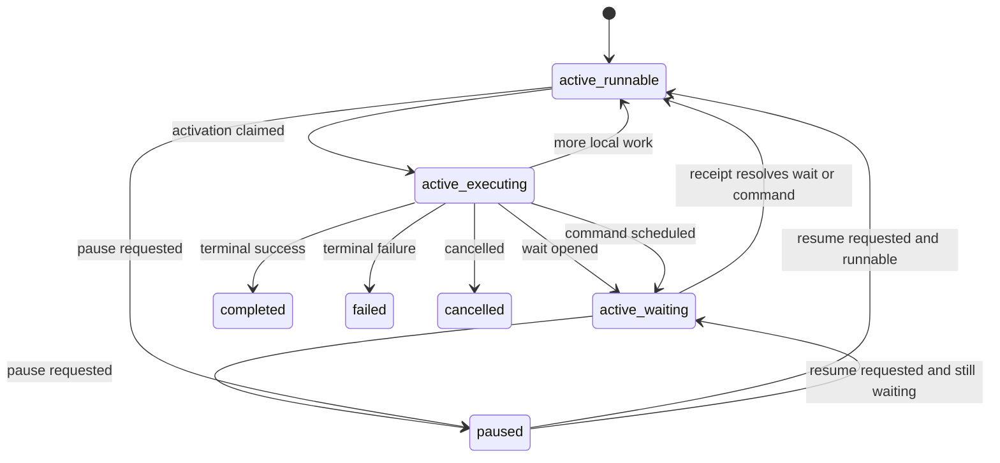

# Runic Durable Orchestration Design Guide

Status: Canonical design guide as of March 6, 2026.

This document supersedes the design portions of [runic-durable-orchestration-assessment.md](./runic-durable-orchestration-assessment.md). The assessment remains useful as source evidence and rationale. This guide defines the implementation target.

Scope:
- Workflow runtime design
- Execution persistence and replay
- Durable waits, commands, receipts, and orchestration semantics
- State model, schema, and implementation boundaries

Out of scope:
- Horde
- Distributed nodes
- Cluster coordination
- Multi-node deployment
- Infrastructure topology

## 1. What Stays, What Changes

### What remains from the assessment

These conclusions were strong and remain unchanged:
- Runic is a good deterministic execution kernel for active workflow transitions.
- Runic is not the full durable orchestration runtime.
- Postgres is the system of record.
- Workflow history must be append-only and replayable.
- Execution must happen in short activation bursts, not one resident process per workflow.
- External side effects must be effectively-once through durable commands and idempotency, not exactly-once.

### What this guide simplifies

The assessment was directionally right, but too broad in a few places. This guide makes the design smaller and more implementable:
- The source-of-truth schema is reduced to seven core tables.
- Timers, signals, and child lifecycle do not get separate core tables.
- Activity and agent work are modeled through one command protocol.
- The instance status model is reduced to `lifecycle_status` and `run_state`.
- Optional UI and reporting models are explicitly non-authoritative.
- Infrastructure and cluster concerns are removed entirely.

## 2. Core Position

The runtime has two layers:

| Layer | Responsibility | Does not own |
| --- | --- | --- |
| Runic kernel | Replay workflow state, evaluate graph transitions, emit durable intents during an activation | Durable storage, leases, waiting, external work execution, ingress dedupe |
| Orchestration runtime | Persist history and projections, claim work, manage waits and commands, ingest receipts, drive replay, expose queryable state | Workflow business logic inside the graph |

The boundary is strict:
- Runic decides what state transition should happen.
- The orchestration runtime decides how that transition becomes durable and how outside work is executed.
- Durable workflow nodes must emit intents. They must not perform opaque side effects directly.

This means the durable API is not `Runic.step(fn -> side_effect end)`. Durable steps are translated into intent emission and later resumed from durable receipts.

## 3. Runtime Model

### 3.1 Activation contract

One activation means:
1. Claim one runnable workflow instance by lease.
2. Load `workflow_instances`, the latest snapshot, and the event tail after `snapshot_seq`.
3. Rebuild the Runic workflow from the pinned definition version plus replayed state.
4. Run until one of these boundaries is reached:
   - no more immediately runnable work
   - a durable wait is opened
   - a durable command is scheduled
   - the workflow completes
   - the workflow fails terminally
5. Persist the full event batch and all operational row changes in one transaction.
6. Release the activation worker.

An activation is intentionally short-lived. Dormant workflows live as rows, not BEAM processes.

### 3.2 Operational invariants

These rules are mandatory:
- Every durable state transition is represented in `workflow_events`.
- `workflow_instances`, `workflow_waits`, `workflow_commands`, and `workflow_snapshots` are updated transactionally with the event append.
- External work is never dispatched before the scheduling transaction commits.
- External inputs are recorded first as receipts, then applied to the instance.
- Only one activation lease may own an instance at a time.
- Optional read models never drive correctness.

### 3.3 Event-sourced history plus operational projections

This design is event-sourced for history and projection-backed for runtime operation.

Authoritative history:
- `workflow_events`

Authoritative operational state:
- `workflow_instances`
- `workflow_waits`
- `workflow_commands`
- `workflow_receipts`
- `workflow_snapshots`

Optional read models:
- `workflow_human_tasks`
- `workflow_agent_sessions`

The rule is simple:
- Events are the audit trail and replay source.
- Operational tables are the durable current state required to run the system efficiently.
- Optional read models exist only for query and UI convenience.

## 4. Canonical Primitives

The design is built on seven core primitives.

| Primitive | Purpose | Notes |
| --- | --- | --- |
| `WorkflowDefinition` | Immutable workflow definition and version record | Instances pin to one version for their full lifetime |
| `WorkflowInstance` | Current lifecycle, run state, sequence, lease, and high-level summary | The main claimable runtime row |
| `WorkflowEvent` | Ordered append-only event stream per instance | Source of truth for history and replay |
| `WorkflowSnapshot` | Replay acceleration checkpoint | Optimization only, never a replacement for history |
| `WorkflowWait` | Open durable passive wait | Used for signal, timer, human, and child waits |
| `WorkflowCommand` | Outbound active work request | Used for activities and agent sessions |
| `WorkflowReceipt` | Deduped inbound input or completion | Ingress boundary for signals, timers, command results, human actions, and child outcomes |

Two behaviors stay first-class, but are implemented on top of the core primitives:
- Human task = `WorkflowWait(kind: :human)` plus an optional `workflow_human_tasks` projection
- Agent session = `WorkflowCommand(kind: :agent_session)` plus an optional `workflow_agent_sessions` projection

Important simplification:
- A command does not also get a mirrored wait row.
- `run_state = waiting` plus `wait_kind = command` is driven by open command rows.
- `workflow_waits` is reserved for passive waits.

## 5. State Model

The instance state model is intentionally small.

### 5.1 Required instance fields

`workflow_instances` must contain at least:
- `instance_id`
- `definition_name`
- `definition_version`
- `lifecycle_status`
- `run_state`
- `wait_kind`
- `last_seq`
- `snapshot_seq`
- `lease_owner`
- `lease_expires_at`
- `next_run_at`
- `last_error`
- `parent_instance_id`
- `inserted_at`
- `updated_at`

### 5.2 Status fields

`lifecycle_status`:
- `active`
- `paused`
- `completed`
- `failed`
- `cancelled`

`run_state`:
- `runnable`
- `waiting`
- `executing`

`wait_kind`:
- `signal`
- `timer`
- `human`
- `child`
- `command`
- `null`

This replaces status explosions like `WAITING_SIGNAL`, `WAITING_TIMER`, `WAITING_HUMAN`, and `WAITING_CHILD`.

### 5.3 State transition rules



Rules:
- `executing` exists only while a valid lease is held by an activation worker.
- `waiting` means the instance is blocked on either open passive waits or open commands.
- `paused` is a lifecycle state, not a run state. A paused workflow still retains waits and commands.
- Terminal states never become runnable again.

## 6. Source-of-Truth Schema

The core schema is:
- `workflow_definitions`
- `workflow_instances`
- `workflow_events`
- `workflow_snapshots`
- `workflow_waits`
- `workflow_commands`
- `workflow_receipts`

There are no core tables for timers, signals, children, activations, or search.

### 6.1 `workflow_definitions`

Purpose:
- Store immutable workflow definitions and version metadata

Required columns:
- `definition_name`
- `version`
- `definition_hash`
- `definition_blob` or compiled artifact reference
- `metadata`
- `inserted_at`

Constraints:
- unique `(definition_name, version)`
- definition rows are immutable after creation

### 6.2 `workflow_instances`

Purpose:
- Store the runtime projection used to claim, replay, and inspect an instance

Required columns:
- `instance_id`
- `definition_name`
- `definition_version`
- `lifecycle_status`
- `run_state`
- `wait_kind`
- `last_seq`
- `snapshot_seq`
- `lease_owner`
- `lease_expires_at`
- `next_run_at`
- `last_error`
- `parent_instance_id`
- `input_summary`
- `output_summary`
- `inserted_at`
- `updated_at`

Indexes:
- `(lifecycle_status, run_state, next_run_at)`
- `(parent_instance_id)`
- `(lease_expires_at)`

### 6.3 `workflow_events`

Purpose:
- Store the ordered event log for one instance

Required columns:
- `instance_id`
- `seq`
- `event_type`
- `payload`
- `causation_key`
- `correlation_key`
- `recorded_at`

Constraints:
- unique `(instance_id, seq)`
- sequence numbers are strictly monotonic per instance

Notes:
- `causation_key` ties an event back to the activation, receipt, or command that produced it.
- `correlation_key` groups related events across parent and child flows when needed.

### 6.4 `workflow_snapshots`

Purpose:
- Accelerate replay

Required columns:
- `instance_id`
- `seq`
- `snapshot_version`
- `definition_name`
- `definition_version`
- `snapshot_blob`
- `summary_json`
- `inserted_at`

Constraints:
- unique `(instance_id, seq)`

Notes:
- `snapshot_blob` may use `:erlang.term_to_binary/1` in an Elixir-native system.
- `summary_json` exists for lightweight inspection and future compatibility work.

### 6.5 `workflow_waits`

Purpose:
- Represent passive waits that do not actively perform work

Kinds:
- `signal`
- `timer`
- `human`
- `child`

Required columns:
- `wait_id`
- `instance_id`
- `kind`
- `wait_key`
- `status`
- `wake_at`
- `payload`
- `opened_seq`
- `closed_seq`
- `inserted_at`
- `updated_at`

Constraints:
- unique open wait on `(instance_id, kind, wait_key)`

Notes:
- `wake_at` is used only for timer waits.
- `wait_key` is the correlation handle:
  - signal key for signal waits
  - timer id for timer waits
  - task id for human waits
  - child instance id for child waits
- Closed waits are retained only if they materially help debugging. If not, they may be deleted after closure because the event log already preserves history.

### 6.6 `workflow_commands`

Purpose:
- Represent durable outbound work requests

Kinds:
- `activity`
- `agent_session`
- `tool_call`

Required columns:
- `command_id`
- `instance_id`
- `kind`
- `idempotency_key`
- `status`
- `input`
- `retry_policy`
- `attempt_count`
- `lease_owner`
- `lease_expires_at`
- `next_attempt_at`
- `timeout_at`
- `opened_seq`
- `finished_seq`
- `last_error`
- `inserted_at`
- `updated_at`

Constraints:
- unique `(instance_id, kind, idempotency_key)`
- unique `(instance_id, command_id)`

Notes:
- Open commands implicitly block the workflow with `wait_kind = command`.
- Do not create a second wait row for a command.

### 6.7 `workflow_receipts`

Purpose:
- Record deduped ingress before it is applied to an instance

Source types:
- `signal`
- `timer`
- `human_action`
- `command_result`
- `child_result`
- `agent_event`

Required columns:
- `receipt_id`
- `instance_id`
- `source_type`
- `source_key`
- `dedupe_key`
- `payload`
- `recorded_at`
- `applied_at`
- `applied_seq`

Constraints:
- unique `(instance_id, source_type, dedupe_key)`

Notes:
- A receipt is written before it is applied.
- Duplicate inputs short-circuit at the receipt layer.
- Late receipts for paused or terminal workflows are still recorded for audit, even when they do not reactivate the workflow.

## 7. What Is Deliberately Not a Core Table

These were explicit simplifications from the assessment.

### No `workflow_timers`

Reason:
- A timer is just a wait with `kind = timer` and `wake_at`.

Implementation:
- A timer scanner polls open timer waits where `wake_at <= now()`.
- For each due wait, the runtime records a timer receipt, appends `TimerFired`, closes the wait, and re-evaluates the instance.

### No `workflow_signals`

Reason:
- Signals are ingress receipts plus workflow events.

Implementation:
- An inbound signal becomes a receipt row with a dedupe key.
- Applying that receipt resolves the matching signal wait and appends `SignalReceived`.

### No `workflow_children`

Reason:
- Parent and child linkage fits in the instance row plus child wait payload.

Implementation:
- The parent wait uses `kind = child` and `wait_key = child_instance_id`.
- The child instance stores `parent_instance_id`.

### No `workflow_activations`

Reason:
- Runnable work can be claimed directly from `workflow_instances`.

Implementation:
- A worker claims instances where:
  - `lifecycle_status = active`
  - `run_state = runnable`
  - `next_run_at <= now()`
  - the lease is unowned or expired

### No `workflow_search`

Reason:
- Search and dashboard views are projections, not source of truth.

Implementation:
- Add read models only after the core runtime works.

## 8. Durable Intent Model

Durable nodes communicate with the orchestration runtime through intents.

```elixir
@type durable_intent ::
        {:wait, wait_spec()}
        | {:command, command_spec()}
        | {:complete, term()}
        | {:fail, term()}

@type wait_kind :: :signal | :timer | :human | :child

@type wait_spec :: %{
        kind: wait_kind(),
        key: String.t(),
        wake_at: DateTime.t() | nil,
        payload: map()
      }

@type command_kind :: :activity | :agent_session | :tool_call

@type command_spec :: %{
        kind: command_kind(),
        idempotency_key: String.t(),
        input: map(),
        timeout: non_neg_integer() | nil,
        retry_policy: map()
      }

@type receipt :: %{
        source_type: atom(),
        source_key: String.t(),
        dedupe_key: String.t(),
        payload: map()
      }
```

Rules:
- Runic nodes emit intents during activation.
- The activation driver translates intents into domain events plus row updates.
- Command dispatch happens after commit, never during Runic evaluation.
- Receipt application is a separate durable step that reactivates the workflow if needed.

## 9. Workflow-Facing Durable Primitives

The durable API exposed around Runic should consist of six primitives.

| Primitive | Intent emitted | Events appended | Rows created or updated | Resolving receipt | Parks? |
| --- | --- | --- | --- | --- | --- |
| `AwaitSignal` | `{:wait, %{kind: :signal, ...}}` | `SignalWaitOpened`, then `SignalReceived` | open `workflow_waits` row, update instance to `waiting/signal` | `source_type = signal` with matching signal key | Yes |
| `SleepUntil` | `{:wait, %{kind: :timer, ...}}` | `TimerWaitOpened`, then `TimerFired` | open timer wait row with `wake_at`, update instance to `waiting/timer` | `source_type = timer` produced by timer scan | Yes |
| `OpenHumanTask` | `{:wait, %{kind: :human, ...}}` | `HumanTaskOpened`, `HumanTaskCommented`, `HumanTaskReassigned`, `HumanTaskResolved` | open human wait row, optional `workflow_human_tasks` projection | `source_type = human_action` for resolution; comments and reassignments do not wake the workflow | Yes |
| `ActivityCall` | `{:command, %{kind: :activity, ...}}` | `CommandScheduled`, then `CommandSucceeded` or `CommandFailed` | open `workflow_commands` row, update instance to `waiting/command` | `source_type = command_result` keyed by command id | Yes |
| `ChildWorkflow` | `{:wait, %{kind: :child, ...}}` plus child start instruction | `ChildWorkflowStarted`, then child terminal event reflected on parent | create child instance, open child wait row, update parent to `waiting/child` | `source_type = child_result` keyed by child instance id | Yes |
| `AgentSession` | `{:command, %{kind: :agent_session, ...}}` | `AgentSessionStarted`, `AgentProgressRecorded`, `AgentSessionCompleted` or `AgentSessionFailed` | open agent command row, optional `workflow_agent_sessions` projection | `source_type = agent_event` or `command_result` keyed by session id | Yes |

Additional rules:
- `ActivityCall` and `AgentSession` are both commands; they use the same lease, timeout, retry, and dedupe protocol.
- `ChildWorkflow` creation and parent wait opening happen in the same transaction.
- `AgentSession` tool calls are nested commands or agent events. They are not opaque work inside a single Runic step.

## 10. Append and Apply Rules

### 10.1 Start workflow

Start transaction:
- append `WorkflowStarted`
- create `workflow_instances` row pinned to `(definition_name, definition_version)`
- optionally create an initial snapshot
- set `run_state = runnable`

### 10.2 Activation commit

An activation commit may do all of the following in one transaction:
- append a contiguous event batch
- update `workflow_instances`
- open or close wait rows
- open or close command rows
- write a snapshot if policy requires it

If any part fails, none of it is durable.

### 10.3 Receipt application

Receipt application is also transactional:
1. insert the receipt row if its dedupe key is new
2. lock the target instance
3. validate that the receipt matches an open wait or command
4. append resulting events
5. close or update the matched wait or command
6. move the instance to `runnable` or keep it waiting

This is the only path by which dormant workflows wake up.

## 11. Implementation Patterns

### 11.1 Claiming runnable instances

Use `workflow_instances` as the claim surface.

Claim policy:
- `lifecycle_status = active`
- `run_state = runnable`
- `next_run_at <= now()`
- `lease_expires_at is null or expired`

On claim:
- set `run_state = executing`
- set `lease_owner`
- set `lease_expires_at`

If the worker dies:
- the lease expires
- another worker can reclaim the instance
- replay starts from the latest snapshot plus event tail

### 11.2 Passive wait scanning

Use `workflow_waits` for passive wake-up detection:
- timer waits are scanned by `wake_at`
- child waits are resolved from child completion receipts
- signal and human waits are resolved by ingress receipts

There is no sleeping process per wait.

### 11.3 Commands as the durable outbox

Use `workflow_commands` as the outbox for side effects:
- schedule the command in the activation transaction
- dispatch only after commit
- claim commands by lease
- retry by policy
- apply results through receipts

This gives effectively-once external execution:
- the intent is durable
- dispatch is retryable
- completion is deduped
- side effects remain safe only if the external target honors the idempotency key

### 11.4 Snapshots at park boundaries

Snapshot policy is explicit:
- snapshot whenever an activation parks on a durable wait
- snapshot whenever an activation parks on an open command
- snapshot every 250 appended events during active bursts

The snapshot should contain:
- pinned definition version
- Runic workflow state needed for restore
- instance summary state
- snapshot schema version

### 11.5 Optional read models

Optional read models are allowed only after the core runtime works.

Examples:
- `workflow_human_tasks` for assignee views and SLA filters
- `workflow_agent_sessions` for transcripts, token usage, and tool timelines

These tables must never be required to resume a workflow.

## 12. Explicit Durable Semantics

### 12.1 Definition evolution

Decision:
- Instances pin to immutable definition versions.
- Structural migration of running instances is out of scope.

Implication:
- New instances can start on a newer version immediately.
- Existing instances stay on their pinned version until completion, failure, or cancellation.

### 12.2 Pause and resume

Decision:
- Pausing blocks new activations.
- Pausing does not cancel waits.
- Pausing does not freeze timers.
- Pausing does not stop in-flight commands automatically.
- Receipts may continue to accumulate while paused.

Resume behavior:
- if all waits remain unresolved, the instance stays `waiting`
- if receipts arrived while paused and the instance is now eligible to run, it becomes `runnable`

### 12.3 Cancellation

Decision:
- Cancellation is terminal.

Behavior:
- append `WorkflowCancelled`
- close open waits
- mark open commands as `cancel_requested`
- stop new activations
- record late receipts for audit, but do not reactivate the workflow

### 12.4 Retry semantics

Decision:
- activation execution is at-least-once
- commands are effectively-once
- global exactly-once is not promised

Rules:
- activation retry comes from lease expiry and replay
- command retry comes from the command record and its retry policy
- retry exhaustion becomes a durable event that the workflow can react to

### 12.5 Child workflow semantics

Decision:
- child orchestration is inter-instance behavior owned by the runtime, not by Runic alone

Rules:
- parent starts child and opens the child wait in one transaction
- child completion is delivered as a receipt to the parent
- parent wake-up happens only from the child terminal result

### 12.6 Human task semantics

Decision:
- human tasks are durable waits with optional projections

Rules:
- open, comment, reassign, and resolve are durable events
- only resolution closes the wait and reactivates the workflow
- comments and reassignment update projections but do not resume execution

### 12.7 Agent session semantics

Decision:
- long-lived agent work runs outside Runic under the command protocol

Rules:
- the session is leased and heartbeat-driven
- progress is durably recorded
- tool calls are nested commands or agent events
- terminal completion or failure produces the receipt that resumes the parent workflow

## 13. Minimal Internal Service Boundaries

The runtime can be implemented cleanly with these boundaries:

| Service | Responsibility |
| --- | --- |
| Definition registry | Store and fetch immutable definition versions |
| Instance store | Own instance rows, event append, snapshots, waits, commands, and receipts |
| Activation driver | Claim runnable instances, rebuild Runic state, execute one burst, commit results |
| Receipt ingester | Record deduped ingress and apply it to waiting instances |
| Command dispatcher | Claim command rows, execute side effects, heartbeat, and publish result receipts |
| Projection updaters | Maintain optional human-task and agent-session read models |

This is enough for a single-node implementation. No further infrastructure decisions belong in this guide.

## 14. Acceptance Scenarios

The implementation is not complete until these scenarios pass:

1. Start a workflow, append events, snapshot it, reload from snapshot plus tail, and continue correctly.
2. Crash after `CommandScheduled` commits but before the external result is processed, then recover without losing intent.
3. Deliver the same signal twice with the same dedupe key and confirm only one receipt is applied.
4. Park on a long timer, restart the application, then fire the timer and resume correctly.
5. Pause a workflow, deliver signals or timer receipts while paused, then resume and continue from durable state.
6. Open a human task, comment, reassign, then resolve it; only resolution should wake the workflow.
7. Start a child workflow and wake the parent only when the child reaches a terminal state.
8. Start an agent session, lose the worker lease, reclaim it, and continue without losing transcript or session state.
9. Replay full instance history and verify the rebuilt durable state matches the stored operational projection.
10. Start new instances on a newer definition version while older instances remain pinned to the old version.

## 15. Suggested Implementation Order

Build in this order:
1. Core event append, instance projection, snapshot load/save, and activation replay loop
2. Passive waits: `AwaitSignal` and `SleepUntil`
3. Command protocol: `ActivityCall`, idempotency, retry, leases, and command result receipts
4. `ChildWorkflow` and parent-child wake-up semantics
5. `OpenHumanTask` plus optional human-task projection
6. `AgentSession` plus optional agent-session projection

This keeps the runtime small at the beginning and adds higher-level orchestration behaviors on top of stable primitives.

## 16. Final Recommendation

Runic should be adopted as the deterministic execution kernel inside a stronger orchestration runtime.

The correct durable architecture is:
- immutable definition versions
- append-only workflow history
- short-lived activation workers
- passive waits for time and ingress
- command rows for side effects and agent work
- receipts as the dedupe boundary for wake-up
- optional read models kept strictly secondary

That is the implementation target for durable, long-lived, stateful workflow orchestration in this codebase.
