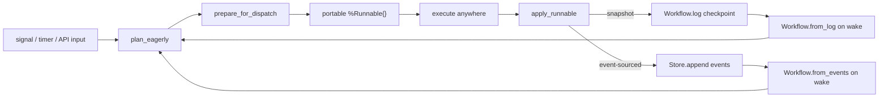
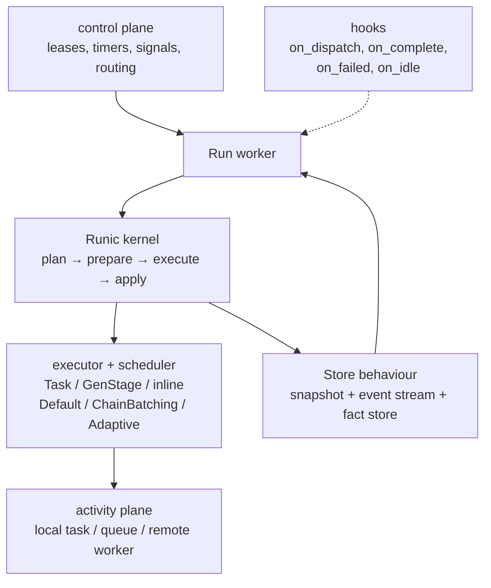

# Designing a Durable Workflow Platform on Runic

This guide is for platform builders. The [Durable Execution](durable-execution.html) guide explains the APIs Runic exposes for persistence and recovery; this guide explains the architectural contract between Runic and the durable runtime built around it.

The central point is simple: **Runic is a workflow execution kernel, not a full durable orchestration system**. That is a strength, not a gap. Runic gives you a replayable workflow state model, portable units of work, and a scheduler boundary that fits local, distributed, or hybrid runtimes. The built-in Runner now ships with pluggable executors, schedulers, hooks, and persistence — a capable local runtime foundation — but the surrounding platform is still responsible for cluster ownership, fencing, durable timers, signals, and operator semantics.

## The Short Version

- Runic workflows are immutable data structures, not process-bound interpreters.
- Execution state lives in workflow data and event history, not in hidden stack frames.
- `Workflow.log/1` captures structure, produced state, and durable runnable lifecycle events.
- `Workflow.from_log/1` rebuilds a workflow from persisted history.
- `Workflow.from_events/2` rebuilds a workflow from an event-sourced stream, supporting lean replay with `FactRef` vertices via the `:fact_mode` option.
- `Workflow.apply_event/2` applies individual granular events (`FactProduced`, `ActivationConsumed`, `JoinCompleted`, etc.) to advance workflow state.
- `Workflow.prepare_for_dispatch/1` and `Workflow.apply_runnable/2` cleanly separate dispatch from state transition.
- `Workflow.pending_runnables/1` lets a runtime detect in-flight work after a crash, but only when policies use `execution_mode: :durable`.
- `Runic.Runner.Store` defines a formal behaviour with required snapshot callbacks and optional event-sourced, snapshot, and fact-storage tiers.
- Rehydration (`Runic.Workflow.Rehydration`) classifies facts as hot or cold and supports three recovery modes: full, hybrid, and lazy — enabling memory-efficient recovery of long-running workflows.
- Pluggable executors (`Runic.Runner.Executor`) and schedulers (`Runic.Runner.Scheduler`) let the platform control how and when runnables are dispatched, including batched dispatch via Promises.
- Hook-based observability (`on_dispatch`, `on_complete`, `on_failed`, `on_idle`, `transform_runnables`) provides platform-level visibility without modifying kernel internals.
- Content-addressable closures (`Runic.Closure`) produce deterministic hashes from `{source, bindings}`, enabling deduplication and portable serialization.
- `Runic.Runner` is a capable local runtime with supervision, lifecycle management, pluggable persistence, configurable checkpoint strategies, and rehydration support — but not a distributed control plane.

## Why Runic Fits a Durable Workflow Engine

Runic has four properties that make it unusually well suited as a durable workflow kernel.

### 1. The workflow is data

Runic models a workflow as a plain Elixir value: a multigraph plus produced facts, scheduling policies, and runnable lifecycle state. The engine is not hiding execution progress in a private mailbox protocol or an opaque interpreter heap. That matters because durable systems need to stop, persist, move, and reconstruct runs repeatedly over long time spans.

### 2. Dispatch is separate from state transition

Runic's three-phase model gives the runtime a clean scheduler boundary:

1. `plan_eagerly/1` or `plan_eagerly/2` discovers work that is now enabled.
2. `prepare_for_dispatch/1` turns enabled work into portable `%Runnable{}` values.
3. `execute` happens anywhere the platform wants.
4. `apply_runnable/2` folds the result back into the workflow state.

That split is exactly what a durable runtime needs. "Execute" can be local, remote, queued, retried, or rate-limited. "Apply" remains the critical section where workflow state advances.

### 3. Structure and runtime state share one replayable history

Runic does not only persist a static definition. `Workflow.log/1` combines:

- The build log: component additions and topology.
- Reaction history: produced facts and causal edges.
- Runnable lifecycle events: dispatch, completion, and permanent failure for durable-mode work.

For event-sourced stores, `Workflow.from_events/2` rebuilds a workflow from a stream of granular events (`FactProduced`, `ActivationConsumed`, `JoinCompleted`, etc.), while `Workflow.from_log/1` rebuilds from the traditional log. Both paths recover the full workflow graph and its runtime state.

### 4. Content-addressable fact storage enables hybrid memory

Facts are content-addressed via `phash2`. Closures are content-addressed via `{source, bindings}`. That means the platform can store fact values and closure definitions by hash, load only the subset currently needed, and resolve the rest on demand. This is the foundation for Runic's rehydration system: a workflow can be reconstructed with lightweight `FactRef` vertices instead of full `Fact` values, and the platform loads only hot facts (pending inputs, active frontier) into memory.

## The Core Design Claim: Execution State Lives in the Workflow

This is the most important statement to carry into a system design doc:

> A Runic workflow run is not "a process plus some hidden memory." It is a workflow value plus its persisted history. If the host runtime can reload that history, it can reconstruct the run and continue.

In practice, the persisted state for a durable Runic run is made of four layers:

| Layer | What it contains | Why it matters |
|-------|------------------|----------------|
| Workflow definition | Components, edges, closures, names, scheduler policies | Rebuilds the graph and future execution possibilities |
| Applied runtime state | Facts already produced and causal reaction edges | Rebuilds where the run currently is |
| Durable execution history | `%RunnableDispatched{}`, `%RunnableCompleted{}`, `%RunnableFailed{}` | Rebuilds what was in flight when a worker died |
| Content-addressed fact values | Fact values keyed by `phash2` hash | Enables hybrid memory — load only the values the current execution frontier needs |

This is different from systems where the durable state is primarily a program counter, a hidden fiber stack, or a proprietary VM journal. In Runic, the durable state is legible domain data.



## What Runic Guarantees

Runic gives the durable platform several strong guarantees, provided the platform persists the workflow history correctly.

| Guarantee | Backed by | Practical meaning |
|-----------|-----------|-------------------|
| Replayable workflow reconstruction | `Workflow.log/1` + `from_log/1` or `from_events/2` | A run can be rebuilt on another process or node from persisted history — via full log replay or event-sourced stream |
| Stable runnable identity | `%Runnable{}` ids are derived from `{node.hash, fact.hash}` | The runtime has a natural idempotency key for tracking or external calls |
| Portable execution units | `prepare_for_dispatch/1` produces self-contained runnables | Dispatch topology is a platform choice, not a kernel constraint |
| Sequential state advancement boundary | `apply_runnable/2` is the state reduction point | The platform can isolate concurrency in execute while serializing apply |
| Recoverable in-flight durable work | Runnable lifecycle events plus `pending_runnables/1` | Interrupted work can be rediscovered and re-dispatched on resume |
| Policy-driven retries/timeouts/fallbacks | `SchedulerPolicy` and `PolicyDriver` | Reliability rules are data attached to the workflow, not scheduler-specific glue |
| Pluggable persistence surface | `Runic.Runner.Store` behaviour | A formal behaviour with required snapshot callbacks and optional event-sourced, snapshot, and fact-storage tiers |
| Event-sourced reconstruction | `from_events/2` + `apply_event/2` + `EventApplicator` protocol | Granular event replay with extensible event types — external libraries can implement `EventApplicator` for custom events |
| Content-addressed fact storage | `Store.save_fact/3` + `Store.load_fact/2` | Fact values stored by hash, loaded on demand — enables hybrid and lazy rehydration |
| Pluggable dispatch optimization | `Scheduler` behaviour + `Promise` | Batched chain execution, adaptive profiling, Flow-based parallelism — without changing workflow semantics |
| Hook-based observability | Worker hooks: `on_dispatch`, `on_complete`, `on_failed`, `on_idle` | Platform-level visibility and light customization without modifying kernel code |

### A note on resumability

Runic offers three distinct recovery properties:

1. **State recovery**: if the persisted log contains all applied work up to a checkpoint, `Workflow.from_log/1` or `Workflow.from_events/2` restores that state.
2. **In-flight recovery**: if durable-mode runnable lifecycle events were persisted, `Workflow.pending_runnables/1` identifies work that had been dispatched but not resolved.
3. **Memory-efficient recovery**: `Workflow.from_events/3` with `fact_mode: :ref` rebuilds the workflow with lightweight `FactRef` vertices instead of full fact values. Combined with `Rehydration.classify/2` and `Rehydration.rehydrate/3`, only hot facts (pending inputs, active frontier) are loaded into memory while cold facts remain in the store.

Those are related, but not identical. A design doc should call out all three.

## What Runic Does Not Guarantee by Itself

A durable workflow platform should not over-claim on behalf of the kernel.

Runic by itself does **not** provide:

- Lease acquisition, cluster ownership, or fencing.
- Durable timers or durable external signals.
- Exactly-once side effects against remote services.
- A distributed queue or a cross-node scheduler.
- Built-in cold storage, passivation, or object-store replication.
- A durable default store across VM restarts when using ETS.
- Automatic long-term code-version compatibility for arbitrary user functions.

The built-in `Runic.Runner` provides supervised workers, task isolation, registry lookup, checkpointing with configurable strategies (`:every_cycle`, `:manual`, `:on_complete`, `{:every_n, n}`), pluggable storage via the `Store` behaviour, pluggable executors (Task-based, inline, GenStage), pluggable schedulers (default, chain-batching, adaptive, Flow-based), batched dispatch via Promises, hook-based observability, and rehydration for memory-efficient recovery. It is a good local runtime and a solid foundation for building a distributed system on top of. It is not the full control plane for a multi-node durable workflow system.

## The Platform Responsibilities Around Runic

If Runic is the execution kernel, the platform around it needs to own the rest of the durable contract.

### Ownership and fencing

Only one worker should be allowed to apply results for a given run at a time. Runic's model strongly encourages this because apply is the single state transition point. In a distributed system that means:

- Lease or claim ownership before activating a run.
- Fence stale owners so an old process cannot append newer state after losing ownership.
- Treat `apply_runnable/2` plus log persistence as the critical section.

### Durable storage

The `Runic.Runner.Store` behaviour defines a formal persistence contract with three tiers:

**Required — snapshot persistence:**

- `save/3` and `load/2` persist and recover the full workflow log.
- This is the minimum a store must implement.

**Optional — event-sourced persistence:**

- `append/3` and `stream/2` provide append-only event streams with cursor tracking.
- `Store.supports_stream?/1` checks whether a store module implements stream semantics.
- When available, the Runner uses `from_events/2` for recovery instead of `from_log/1`.
- `save_snapshot/4` and `load_snapshot/2` allow periodic snapshots to reduce replay cost on top of the event stream.

**Optional — fact-level storage:**

- `save_fact/3` and `load_fact/2` store and retrieve individual fact values by content hash.
- Required for hybrid and lazy rehydration modes.
- Enables the platform to keep cold fact values out of memory entirely.

The built-in `Store.ETS` and `Store.Mnesia` adapters implement all three tiers. ETS is process-local convenience within a single VM. Mnesia (with `disc_copies: true`) provides local disk durability and supports distributed storage across Erlang clusters. A custom SQLite, Postgres, or object-store backed adapter is the normal choice for production-grade workflow engines.

### Timers and signals

Durable timers and external signals are not native Runic concepts. They are platform-level inputs that wake or feed a workflow. The platform should:

- Persist timer intent outside the in-memory worker.
- Persist signals even if the workflow is currently dormant.
- Deliver timer fires and signals back into the workflow as regular inputs or domain events.

### Activity semantics

The execute phase may perform side effects. That pushes the classic durable workflow contract to the boundary between Runic and the external world:

- Workflow progression can be made exactly-once with atomic persistence around apply.
- External activity execution is at-least-once unless the remote service honors an idempotency key.
- Runnable ids are the right primitive for those idempotency contracts because they are stable for a given node-fact invocation.

### Passivation and mobility

Because the workflow is reconstructible from persisted history, a durable runtime can:

- Stop an idle worker and keep only persisted state.
- Move a run to another node.
- Cold-load a run months later with rehydration for memory-efficient recovery — `from_events/3` with `fact_mode: :ref` rebuilds the graph without loading cold fact values, and `Rehydration.rehydrate/3` resolves only the hot subset.
- Offer offline inspection and replay tooling.

Runic enables those behaviors. The platform still has to implement the storage tiers and wake-up mechanics.

**Critical: `run_context` must be reconstructed, not deserialized.** Platform values injected via `Workflow.put_run_context/2` (credential resolvers, scope references, connection pool handles) may contain process-bound or environment-specific state that does not survive serialization. On resume, the platform must rebuild `run_context` from durable metadata (e.g., Postgres `workflow_runs` row) and re-inject it via `put_run_context/2` before resuming execution. Treat `run_context` as ephemeral — set at start, reconstructed on wake, never relied upon from the serialized checkpoint.

### Rehydration and memory management

Long-running workflows can accumulate thousands of produced facts. Rehydration (`Runic.Workflow.Rehydration`) provides memory-efficient recovery by classifying facts and loading only what the current execution frontier needs.

**Hot/cold classification** (`Rehydration.classify/2`):

- **Hot facts**: pending runnable inputs, active frontier (latest-generation facts), meta-ref targets, pending join inputs.
- **Cold facts**: everything else — historical intermediate values that are no longer needed for forward progress.

**Three recovery modes** (configured via `Runner.resume/3` `:rehydration` option):

- `:full` (default) — all fact values loaded into memory. Simplest, highest memory use.
- `:hybrid` — lean replay with `FactRef` vertices, then resolve only hot fact values from the store. Best balance of memory savings and execution readiness.
- `:lazy` — all facts stay as `FactRef` structs, resolved on demand via `FactResolver` during dispatch. Maximum memory savings.

**Platform guidance**: `Rehydration.should_rehydrate?/2` estimates whether a workflow would benefit from hybrid recovery based on fact count and value size thresholds (configurable via `:min_facts` and `:min_value_bytes` options). Use this to decide dynamically between full and hybrid resume.

## The Runner as a Local Runtime Foundation

The built-in `Runic.Runner` is more than a reference implementation — it is a capable local runtime that handles the execution lifecycle within a single node. Understanding what it provides helps platform builders identify exactly what remains their responsibility.

### What Runner provides

- **Supervision and lifecycle**: `start_workflow/4`, `run/4`, `stop/3`, `get_results/2`, `list_workflows/1` — a complete workflow lifecycle API under OTP supervision.
- **Recovery**: `resume/3` loads persisted state and restarts a workflow, with configurable rehydration modes (`:full`, `:hybrid`, `:lazy`).
- **Pluggable persistence**: any module implementing the `Store` behaviour. Built-in ETS and Mnesia adapters cover development and single-node production.
- **Pluggable executors**: `Executor.Task` (default async), `:inline` (synchronous), `Executor.GenStage` (backpressure-aware). Per-component executor overrides via `SchedulerPolicy`.
- **Pluggable schedulers**: `Scheduler.Default` (one-at-a-time), `Scheduler.ChainBatching` (batches linear chains into Promises), `Scheduler.Adaptive` (profiling-based), `Scheduler.FlowBatch` (GenStage Flow-based parallelism).
- **Promises**: batched execution units that group runnables for sequential chain execution or parallel fan-out, reducing process spawn overhead.
- **Checkpoint strategies**: `:every_cycle`, `:manual`, `:on_complete`, `{:every_n, n}` — the platform chooses the durability/performance trade-off.
- **Hooks**: `on_dispatch`, `on_complete`, `on_failed`, `on_idle`, `transform_runnables` — observability and light customization without touching kernel code. Hook exceptions are logged but never crash the Worker.
- **Rehydration**: automatic hybrid/lazy recovery when the store supports fact-level storage.

### What the platform still needs

Even with Runner handling local execution, a distributed durable platform must add:

- **Cluster ownership**: lease acquisition, fencing, and run-to-node assignment.
- **Cross-node routing**: discovering which node owns a run and forwarding inputs.
- **Durable timers and signals**: persisted outside the in-memory worker, delivered on wake.
- **Production store adapter**: Postgres, SQLite, or object-store backed — ETS and Mnesia cover development and single-node use.
- **Monitoring and alerting**: telemetry aggregation, SLA tracking, operator dashboards. Runner emits telemetry events; the platform wires them to observability infrastructure.

Runner is the right starting point for a single-node durable runtime and a solid foundation for building a distributed one. The platform layers above it own the parts that require coordination across nodes.

## The Recovery Model You Can Rely On

The recovery path should be described explicitly in any durable design built on Runic. Two paths are available depending on the store's capabilities.

### Snapshot-based recovery

```elixir
{:ok, log} = Store.load(run_id, store_state)
workflow = Workflow.from_log(log)

workflow =
  workflow
  |> Workflow.plan_eagerly()

pending = Workflow.pending_runnables(workflow)

# Re-dispatch pending durable work if needed
```

### Event-sourced recovery with rehydration

```elixir
{:ok, events} = Store.stream(run_id, store_state)
workflow = Workflow.from_events(events, nil, fact_mode: :ref)

# Classify and resolve only hot facts
{workflow, resolver} = Rehydration.rehydrate(workflow, {StoreMod, store_state})

workflow =
  workflow
  |> Workflow.plan_eagerly()

pending = Workflow.pending_runnables(workflow)

# Re-dispatch pending durable work, using resolver for on-demand fact loading
```

### Using Runner.resume/3

For most platforms, `Runner.resume/3` handles the recovery path automatically:

```elixir
{:ok, pid} = Runner.resume(runner, run_id, rehydration: :hybrid)
```

This loads persisted state, rebuilds the workflow (using event-sourced recovery when the store supports it), applies the chosen rehydration mode, and starts a new supervised Worker.

### Recovery steps

Both paths follow the same logical sequence:

1. Load the last persisted history (log or event stream).
2. Rebuild the workflow value (optionally with lean replay for memory efficiency).
3. Resolve hot fact values if using hybrid or lazy rehydration.
4. Re-plan enabled work from reconstructed state.
5. Re-dispatch in-flight durable work that was dispatched but not resolved.
6. Continue the normal prepare -> execute -> apply loop.

### Why this is safe

It is safe because the persisted state records the parts of execution that matter:

- Graph construction (via `ComponentAdded` events or log entries).
- Applied facts and causal state (via granular events like `FactProduced`, `ActivationConsumed`, `JoinCompleted`, etc.).
- Durable runnable lifecycle transitions.

The worker process itself is disposable. That is exactly what you want in a durable engine.

### Why this still needs idempotency

If a worker crashes after an external activity actually ran but before its completion was durably recorded and applied, recovery may re-dispatch that activity. That is why Runic makes durable replay possible but does not magically eliminate the need for idempotency at service boundaries.

## Necessities Imposed by Runic's Design

These are the practical conditions that must hold if the durable platform is going to rely on Runic safely over long periods.

### 1. Use durable-mode policies for work that must be recoverable in flight

`pending_runnables/1` only has something to inspect when the runtime recorded `%RunnableDispatched{}`, `%RunnableCompleted{}`, and `%RunnableFailed{}` events. In Runic that means using scheduler policies with `execution_mode: :durable`.

If you do not enable durable mode for a step, the platform can still recover from the last persisted checkpoint, but it cannot reason about interrupted in-flight attempts for that step.

### 2. Persist after state transition boundaries

The durable unit is the workflow history. The platform should persist after apply boundaries or on an intentionally chosen checkpoint policy. Persisting only "start" signals or only external queue state is not enough.

### 3. Keep apply single-writer per workflow

Runic is highly parallel in prepare and execute, but logically single-writer in apply. That maps naturally to one worker process per run and one serialized state commit path per run.

### 4. Treat runnable ids as first-class operational identifiers

Runnable ids should be used for:

- Idempotency keys to remote services.
- Correlation ids in logs and traces.
- Deduplication of external completions.
- Recovery reasoning across retries.

### 5. Respect serialization rules for long-lived workflows

Runic can serialize workflow construction because component closures are preserved in the build log. Content-addressable closures (`Runic.Closure`) strengthen this guarantee: closures are hashed from `{source_ast, bindings}`, producing deterministic identifiers that survive serialization round-trips. Closure validation rejects non-portable values (PIDs, references, anonymous functions) at construction time, catching serialization problems early rather than at recovery time.

Long-lived durable systems still need discipline:

- Pin captured values with `^` so the serialized closure has the actual data it needs.
- Avoid relying on ambient local variables that will not survive a log round trip.
- Be cautious about future code changes for modules referenced by long-lived workflows.
- Version workflow definitions when runs may outlive deploys.
- **Avoid capturing structs in closure bindings when the struct shape may evolve.** If a compiler IR struct (e.g., `%IR.Step{}`) is captured in a work function closure, adding or removing a field in a later deploy will cause pattern-match failures when the old closure is deserialized. Prefer capturing plain maps with only the fields the closure needs. The `compiler_version` check helps detect incompatibility, but the failure mode is subtle: it's the deserialized Elixir term inside the log blob that breaks, not the SQLite schema.

### 6. Separate kernel guarantees from store guarantees

Runic guarantees replayability. The store determines durability level:

- ETS is process-local convenience, not VM-durable storage. It does implement all three Store tiers (snapshot, event-sourced, fact storage), making it useful for development and testing.
- Mnesia (with `disc_copies: true`) provides local disk durability and supports distributed storage across Erlang clusters. It also implements all three tiers.
- A custom SQLite, Postgres, or object-store backed adapter is the normal choice for production-grade workflow engines.

### 7. Design persistence strategy around your durability requirements

Runic supports two complementary persistence models, and the platform should choose deliberately:

- **Snapshot-based** (`save/3` + `load/2`): persist the full workflow log at checkpoint boundaries. Simple, self-contained, higher write volume. Recovery replays the entire log.
- **Event-sourced** (`append/3` + `stream/2`): append granular events incrementally. Lower per-checkpoint write cost, natural audit trail. Recovery replays the event stream via `from_events/2`. Add periodic snapshots (`save_snapshot/4` + `load_snapshot/2`) to bound replay cost.

Snapshots on top of the event stream are an optimization, not the semantic source of truth. The design doc should be clear about which model is primary and how snapshots reduce replay cost without replacing the replay model.

### 8. Choose a checkpoint strategy matching durability requirements

Runner supports four checkpoint strategies:

- `:every_cycle` — checkpoint after every dispatch cycle. Maximum durability, highest write load. Good default for workflows with expensive or side-effecting steps.
- `{:every_n, n}` — checkpoint every N cycles. Reduces write load while bounding potential replay on crash.
- `:on_complete` — checkpoint only when the workflow reaches a terminal state. Lowest write load, but all intermediate state is lost on crash.
- `:manual` — the platform controls when to checkpoint via `Runner.checkpoint/2`. Maximum flexibility for batching persistence with other operations.

The right choice depends on the cost of re-executing work versus the cost of persistence. For workflows with idempotent pure computations, less frequent checkpointing is safe. For workflows with side-effecting activities, checkpoint after every apply that records a side effect.

## Why Runic Is Architecturally Different

Runic has a different center of gravity from many workflow systems:

- It is **process-agnostic** rather than shipping one required runtime topology.
- It is **dataflow-first** rather than thread-first.
- It persists **workflow structure and execution state together** rather than treating the definition as static code outside the log.
- It gives you a **portable runnable** as the unit of execution, which fits local tasks, queues, or remote workers.
- It makes **execution and scheduling pluggable** — the same workflow can run with different executors (Task, inline, GenStage), schedulers (default, chain-batching, adaptive), and checkpoint strategies without changing workflow semantics.
- It supports **hybrid memory recovery** — content-addressable facts and rehydration let the platform trade memory for I/O, loading only what the execution frontier needs.

That is why a design built on Runic can use very different operational shapes without changing the workflow semantics:

- One worker process per run.
- A queue-backed activity plane.
- A node-local SQLite shard per run.
- A remote execution mesh.
- A passivating "load, run, persist, stop" model.

The workflow semantics stay in the kernel. The runtime topology stays in the platform.

## How To Phrase the Platform Guarantees

If you want sharp wording in a system design doc, these are the claims Runic can honestly support when paired with the right storage and ownership model:

- **Execution state is part of workflow state.** A run is reconstructible from persisted workflow history, not tied to the lifetime of any one worker process.
- **Resumability is history-based.** `Workflow.log/1` provides the portable persisted form and `Workflow.from_log/1` rebuilds the run; `Store.append/3` provides incremental event persistence and `Workflow.from_events/2` rebuilds from the event stream. Both paths produce the same workflow state.
- **Dispatch is topology-independent.** The workflow kernel does not care whether runnables execute in local tasks, remote workers, or a queue-backed activity plane.
- **Apply is the durable commit point.** Parallelism belongs in execute; workflow state progression belongs in a serialized apply-and-persist boundary.
- **In-flight durable work is recoverable.** With durable-mode scheduler policies, interrupted runnables can be rediscovered with `pending_runnables/1` and re-dispatched.
- **Event-sourced persistence enables incremental durability.** With a stream-capable store, only new events are appended at each checkpoint — no full-log rewrite.
- **Memory-efficient recovery is built in.** Rehydration classifies facts as hot or cold and loads only what forward progress requires, keeping cold historical values in the store.
- **Dispatch optimization is configurable.** Schedulers and Promises let the platform batch, profile, or parallelize dispatch without changing workflow definitions.
- **External effects remain idempotency-boundary work.** The platform can make workflow state progression exactly-once; remote side effects still need idempotency contracts.

## Recommended Platform Shape

The cleanest mental model is:



In that model:

- The control plane decides who owns a run and when it should wake up.
- The Store behaviour makes the run reconstructible, with optional event-sourced and fact-storage tiers for incremental persistence and hybrid memory.
- Runic provides workflow semantics and replay.
- The executor and scheduler layer controls how runnables are dispatched — individually, in batched chains, or in parallel groups — without changing workflow semantics.
- The activity plane performs side-effecting work.
- Hooks provide observability into the Worker lifecycle without coupling platform concerns to kernel code.

That separation is the main architectural benefit of using Runic as the kernel.

## Final Takeaway

Runic's unique value in a durable workflow engine is not that it already implements every distributed systems feature around durability. Its value is that it gives the platform a **clean, replayable, topology-independent execution core** with a richer kernel foundation than a bare replay model: formal persistence behaviours, pluggable execution and scheduling, content-addressable storage, and memory-efficient recovery are part of the kernel contract.

Because workflow structure, produced state, and durable runnable history all live in a portable model, the surrounding platform can add storage, ownership, timers, signals, and operator tooling without fighting the kernel. That is the right place to be: Runic owns workflow semantics, and the platform owns distributed durability.
